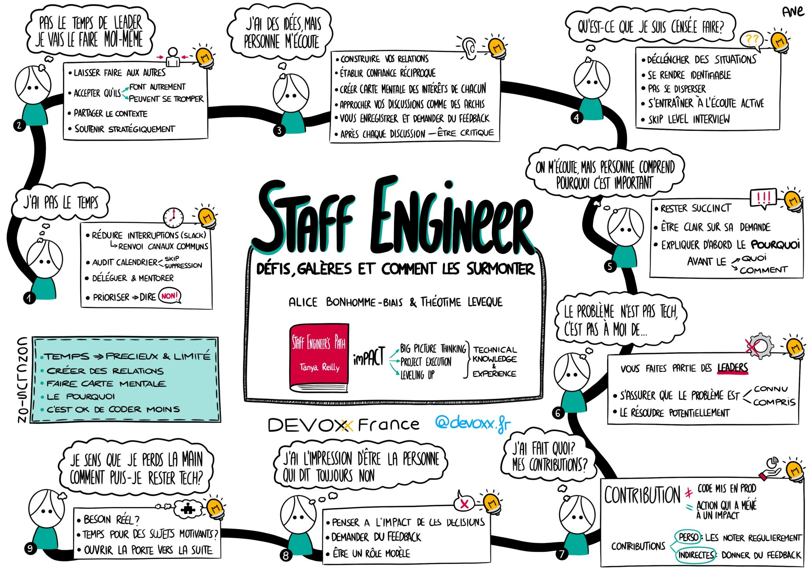

# Devoxx 2025 - Jour 3

## DuckDB, le canard qui a révolutionné le Datalake

*Vincent Heuschling (Datatask)*

Talk intéressant sur DuckDB et ses capacités.

DuckDB est un moteur de base de données SQL en mémoire, optimisé pour l'analyse de données

> SQLite for OLAP

- Embeddable dans des scripts Python
- Run en WASM dans un Navigateur
- [Extensions][duck_db_extensions] utiles pour la Data Science :
  - UI
  - Notebook
  - Support Parquet

[duck_db_extensions]: https://duckdb.org/docs/stable/extensions/core_extensions

## Introduction à la cryptographie post-quantique

*Maxime Gosselin (Oodrive)*

PQC : Post Quantum Cryptography

L'informatique quantique va mettre à mal les technologies de Cryptographie existantes.

L'ordinateur quantique n'existe pas encore, mais le risque est déjà présent :
- Captation et Sauvegarde de trafic chiffré
- Déchiffrement ultérieur

Nouveaux algorithmes d'échange de clé pour s'en protéger (ML-KEM, ...) disponibles dans OpenSSL

Approche Hybride pour l'instant en cas de faille dans les protocoles PQC : Traditionnel + PQC

## Staff Engineer : les défis, les galères, et comment les surmonter

*Alice Bonhomme-Biais (Freelance), Théotime Levêque (Back Market)*

Excellent talk sur le rôle de Staff Engineer.

## The DDD Horror Picture Show

*Thomas PIERRAIN (Agicap), Pauline Jamin (Agicap)*

Thomas et Pauline commencent par présenter certains antipatterns du DDD :
 - Aggregates everywhere
 - Event Obsession
 - Vampire Bounded Context

Ils arrivent finalement à la conclusion que ces patterns ne sont pas propres au DDD mais généraux, souvent un Cargo Cult.

Golden Hammer / Silver Bullet

> When you have a hammer, everything looks like a nail

Astuces pour y remédier :
 - Canard en Plastique
 - Veille technologique (en particulier pour identifier ce qui ne marche pas)
 - ADR
 - Minimum 3 solutions (la Brute, le Truand, le Bon)
 - Métriques
 - A plusieurs (Mob / Software Teaming)
 - Boring Architecture
 - Rasoir d'Ockham
 - Problème Technique… ou Problème Métier ?

Erreurs courantes :
 - Distortion des indicateurs : utiliser la conformité au processus comme indicateur
 - Pression sociale : Hype Driven Development vs Maturité
 - Resistances aux Feedbacks critiques

Contre-mesures :
 - [Méthode (ou Carnet) de Feynman][method_feynman]. Les **ADR** peuvent être un bon moyen de le faire.
 - Budget Complexité : se limiter dans la complexité et le nombre de composants.
 - Cartographie des résultats attendus : pour chaque techno, indicateurs de réussite prédéfinis + clause de sortie. ex. **Tech Radar**

Food for Thought : Residuality Theory -> Stresser un System pour garder le dernier truc qui reste, et itérer.
TODO: à creuser

[method_feynman]: https://www.prepa-dalloz.fr/conseils/methodologie/la-methode-feynman-ou-methode-de-la-feuille-blanche