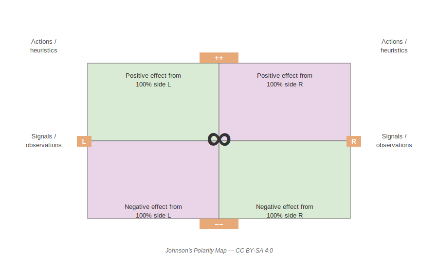

# FlowCon 2026 - Slow down to speed up your decision-making

## Slow down to speed up your decision-making

*Gien Verschatse (Aardling)*

Drawing from a decade of research into decision-making theory, Gien walks through a framework for making better technical and organisational decisions by investing more time upfront in framing and options.

### What is a decision?

> A choice between two or more alternatives that involves an irrevocable allocation of resources.

### The decision maker

Three ingredients required:
- **Authority** — job title, position, legitimacy
- **Commitment** — willingness to actually make the decision
- **Permission** — from management, and from the people impacted

**Frame**: the view of the decision maker — the lens through which the choice is perceived.

### What is a polarity?

> A polarity is an interdependent pair of opposing values or strengths held in ongoing tension — both poles are needed, and neither is "correct" in isolation. Over-focusing on one pole eventually surfaces its downsides, which pulls the system back toward the other pole.

Typical software examples: *speed ↔ deliberation*, *autonomy ↔ alignment*, *stability ↔ change*, *individual ↔ team*.

### Polarity vs Alternative

| Polarity                                | Alternative           |
|-----------------------------------------|-----------------------|
| Cannot be solved, must be *managed*     | Can be chosen between |
| Ongoing tension between two valid poles | Finite set of options |

💡 recognize polarities early — trying to "solve" them is a trap. Use a polarity management matrix instead.

## Problem

### Problem management

Two valid strategies:
- **Solving** the problem
- **Making it irrelevant** (reframe so it no longer matters)

### Problem statement

> The hardest part is framing the problem. It is also the part we spend the least amount of time on.

Common pitfalls:
- No focus
- Focus is driven by assumption or a pre-baked solution

⚠️ The way you state a problem directly shapes the solution space you will explore.

**Problem restatement techniques:**
- Paraphrase
- Redirect focus
- Ask *why*

### Reframing Canvas

| Lens                   | Question                                 |
|------------------------|------------------------------------------|
| Frame the problem      | What's the problem? Who's involved?      |
| Look outside the frame | What are we missing?                     |
| Rethink the goal       | Is there a better goal to pursue?        |
| Examine bright spots   | Are there positive exceptions?           |
| Look in the mirror     | What is my role in creating the problem? |
| Take perspective       | What problem are *they* trying to solve? |

## Information

- Collaborative modeling helps surface what's actually known vs assumed.
- 💡 if having certain information doesn't change your mind, it's worthless. Don't chase data that won't move the decision.

## Options / Alternatives

- Design alternatives deliberately — alternatives generate more alternatives.
- Always aim for **at least 3 alternatives**: two options collapse into an "us vs them" debate; a third option reopens the design space.

## Heuristics

> A heuristic is anything that provides a plausible aid or direction in the solution of a problem but is in the final analysis unjustified, incapable of justification and **fallible**. It is anything that is used to guide, discover and reveal a possibly, but not necessarily, correct way to solve a problem.
>
> — Billy Vaughn Koen

## Preferences

- If there are no preferences, you don't actually care about the outcome.
- Investigating preferences is itself a way to generate information about the decision.

## Making choices

Two complementary tools:
- **Razors** — principles to shave off options quickly (e.g. Occam's razor, Hanlon's razor)
- **Analysis** — structured Pros vs Cons+Fix comparison

### Information × Time matrix

|                           | Low time   | High time |
|---------------------------|------------|-----------|
| **Information available** | Heuristics | Analysis  |

How much time to invest? Depends on the **value** and **reversibility** of the decision.

### Reversible vs Irreversible — the door metaphor

- **2-way door** (reversible): move fast, decide cheaply
- **1-way door** (irreversible): slow down, invest in framing and alternatives

### Consider uncertainty

⚠️ **Resulting**: equating the quality of your decision to the quality of the outcome.

- Good decision ⇏ Good outcome
- Bad decision ⇏ Bad outcome

💡 judge decisions by the process, not by the result. Outcomes are noisy; process is what you can repeat.

## References

### People
- **Gien Verschatse** — Consultant & software engineer at Aardling, researcher on decision-making theory. [Blog][gien-blog] · [LinkedIn][gien-linkedin]
- **Billy Vaughn Koen** — engineer and philosopher, author of *Discussion of the Method*, known for his definition of heuristics.

### Books
- *Collaborative Software Design* — Evelyn van Kelle, Gien Verschatse, Kenny Baas-Schwegler (Manning)
- *Discussion of the Method: Conducting the Engineer's Approach to Problem Solving* — Billy Vaughn Koen

### Concepts
- **Polarity Management** — managing ongoing tensions (Barry Johnson)
- **Reframing Canvas** — tool for challenging problem statements
- **1-way vs 2-way door decisions** — heuristic popularised by Jeff Bezos
- **Resulting** — cognitive bias described by Annie Duke in *Thinking in Bets*

### Links
- [Talk listing on Gien's blog][talk-post]
- [FlowCon 2026 schedule][flowcon-sched]

[gien-blog]: https://www.gienverschatse.com/
[gien-linkedin]: https://www.linkedin.com/in/gien-verschatse/
[talk-post]: https://www.gienverschatse.com/talks/2026/03/31/talk-flowcon/
[flowcon-sched]: https://flowcon2026.sched.com/event/2DqT2/slow-down-to-speed-up-your-decision-making
