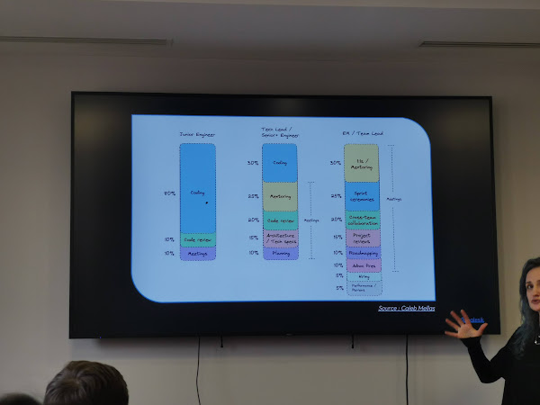
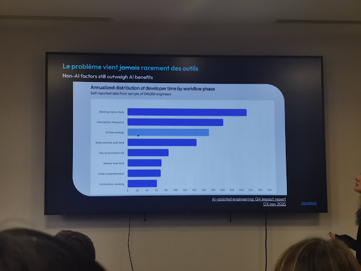
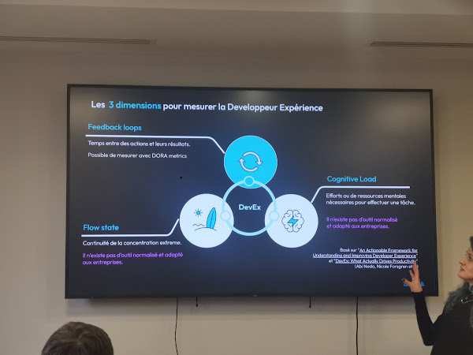
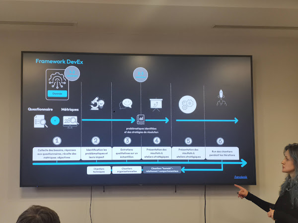
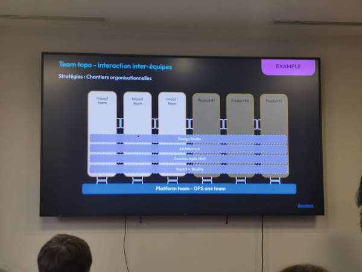

# FlowCon 2026 — La DevEx : quand l'expérience compte

*Lana Lesik (OCTO Technology)*

## Pourquoi penser à l'expérience développeur ?

La DevEx agit sur plusieurs leviers simultanément :

- Améliorer la qualité du produit et l'user experience
- Accélérer le delivery (time-to-market)
- Rendre les devs (et pas que) heureux
- Retenir et attirer des talents
- Réduire la charge cognitive (et le burnout)
- Améliorer le flow
- Stimuler l'innovation
- Augmenter la productivité des développeurs

💡 L'objectif final : mieux **s'adapter à la complexité croissante** des systèmes modernes et **gagner un avantage sur le marché**.

## Définir la DevEx

Trois lectures selon les acteurs :

| Acteur | Définition |
|--------|-----------|
| **GitHub** | Processus socio-technique conçu pour améliorer la performance des équipes en les alignant avec les missions et la culture de l'organisation |
| **Microsoft** | Facilité d'effectuer les tâches |
| **Atlassian (getDX)** | Rôle, expérience et satisfaction dans le cycle de vie du développement logiciel |

## Le quotidien d'un développeur est complexe

Un dev navigue quotidiennement dans un environnement dense : Agilité, Soft skills, Maîtrise de plusieurs frameworks, Observabilité, Cloud, Sécurité, CI/CD pipeline, Onboarding, Architecture, Craftsmanship, Synchronisation entre les équipes, Micro services, Design Système, IA, Documentation, SRE, Communication/Collaboration.

> En moyenne, **84 minutes de coding pur par jour** (hors testing, debugging, reviews)

Le temps réellement consacré au code varie fortement selon le rôle :

## Le problème ne vient (presque) jamais des outils

Les **meeting-heavy days** et la **fréquence des interruptions** dominent la perte de temps des développeurs — bien devant les économies permises par l'IA.

💡 Agents IA, IDP, vibe coding... on empile des outils en pensant gagner en vitesse, mais le vrai problème reste humain : communication, collaboration, organisation.

## Les 3 dimensions pour mesurer la DevEx

- **Feedback loops** : temps entre une action et son résultat — mesurable via les DORA metrics.
- **Flow state** : continuité de la concentration. ⚠️ Il n'existe pas d'outil normalisé et adapté aux entreprises.
- **Cognitive Load** : efforts mentaux pour effectuer une tâche. ⚠️ Il n'existe pas d'outil normalisé et adapté aux entreprises.

> Basé sur *An Actionable Framework for Understanding and Improving Developer Experience* et *DevEx: What Actually Drives Productivity* (Abi Noda, Nicole Forsgren et al.)

## Framework DevEx

6 étapes :

1. Collecte des besoins, réponses aux questionnaires, récolte des métriques objectives
2. Identification des problématiques et de leurs impacts
3. Entretiens qualitatifs sur un échantillon
4. Présentation des résultats & ateliers stratégiques
5. Présentation des résultats finaux & ateliers stratégiques
6. Run des chantiers pendant les itérations

Trois types de chantiers :
- **Techniques**
- **Organisationnels**
- **"Humains" relationnels/comportementaux** — les plus difficiles à gérer, surtout pour un prestataire externe

## Limites d'amélioration de la DevEx

Le périmètre actionnable dépend de la position dans l'organisation. La DevEx est le résultat de toutes les couches :

| Niveau | Leviers |
|--------|---------|
| **Direction** | Stratégies de développement / KPI / le WHY |
| **Culture** | Transformation culturelle / Valeurs |
| **Organisation** | Méthodologies d'organisation / Agilité / Vision Produit / Design Système / Team Topo |
| **Écosystème** | IDP / Archi / CI-CD / "Shift left" / Automatisation |
| **Développeur** | CR / Documentation / CRAFT / Assistance code / Onboarding |

💡 Les enjeux d'amélioration dépassent souvent le seul périmètre des développeurs.

## Outils de mesure

### Questionnaire itératif (par sprint)

Échelle de Likert : *Très peu – Légèrement – Moyennement – Assez – Beaucoup*

- À quel point le sprint était-il mentalement exigeant ?
- À quel point la communication était-elle fluide pendant le sprint ?
- À quel point vous êtes-vous senti pressé par le temps durant le sprint ?
- À quel point avez-vous réussi à atteindre les objectifs fixés pour le sprint ?
- À quel point votre travail était-il exigeant pour répondre aux exigences du sprint ?
- À quel point vous êtes-vous senti frustré ou stressé pendant le sprint ?

### Entretiens individuels — questions ouvertes

- Quelles sont les tâches ou responsabilités qui te demandent le plus d'effort mental ?
- Est-ce que certains types de changements de contexte sont plus perturbants que d'autres ?
- Peux-tu me décrire une journée et/ou tâche typique ?
- Ta plus grande difficulté dans ton activité ?
- Qu'est-ce qui t'aide dans cette situation / dans ton quotidien ?
- Que penses-tu de la répartition des responsabilités et de la charge de travail dans l'équipe ?

## Outils d'amélioration de DevEx

**Coding assistant**
- Bye bye boilerplate !
- Autofix / Dependabot — fix vulnerabilities
- Documentation aux petits oignons

**Internal Developer Portal (IDP)**
- Centralisation et recensement d'outils
- Facilite le quotidien et l'onboarding des devs
- ⚠️ Faire des IDP c'est très coûteux !

**"Shift Down"**
- Coûteux au début, ça prend du temps
- Demande de gouvernance transverse
- Changement organisationnel : équipe dédiée

## Stratégies organisationnelles

### Éviter le SPOF sur le Tech Lead

Deux approches : équipes **sans TL** ou avec un **rôle de TL tournant**.
- Traditional teams : Project Manager / Team Lead hiérarchique
- Agile teams : Self-organizing + Servant Leader / Facilitator

### Team Topology — interaction inter-équipes

### "One team" : permanence et perméabilité

|  | **Permanence élevée** (vie longue) | **Permanence basse** (vie courte) |
|--|--|--|
| **Perméabilité basse** (équipiers stables) | Steady team | Mission team |
| **Perméabilité élevée** (équipiers changeants) | Dynamic team | Liquid team |

## Takeaways

1. Le quotidien d'un développeur est **complexe** et ne se réduit pas à une production de code.
2. Mesurer une expérience aussi complexe nécessite un outil conçu avec **rigueur**, **centré sur l'humain** et **facile à utiliser**.
3. Les enjeux d'amélioration dépassent souvent le seul périmètre des développeurs. L'amélioration de la DevEx doit s'inscrire dans la **stratégie de l'entreprise**.

## References

**Personnes**
- Lana Lesik — Consultante OCTO Technology
- Abi Noda — Co-auteur des papers DevEx
- Nicole Forsgren — Chercheuse, co-auteur DORA & DevEx

**Livres & articles**
- [An Actionable Framework for Understanding and Improving Developer Experience](https://queue.acm.org/detail.cfm?id=3595878) — Noda, Forsgren et al.
- [DevEx: What Actually Drives Productivity](https://queue.acm.org/detail.cfm?id=3595878) — Noda, Forsgren et al.
- [AI-assisted engineering: GitLab impact report](https://about.gitlab.com/developer-survey/) — DX nov 2025
- [Frictionless Developer Experience Book](https://developerexperiencebook.com/)

**Concepts**
- [DORA metrics](https://dora.dev/) — Deployment Frequency, Lead Time, MTTR, Change Failure Rate
- [Team Topologies](https://teamtopologies.com/) — Manuel Pais & Matthew Skelton
- [getDX](https://getdx.com/) — Atlassian's DevEx measurement platform
