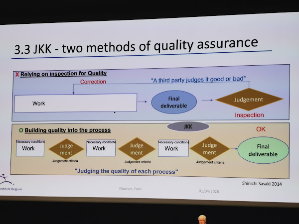
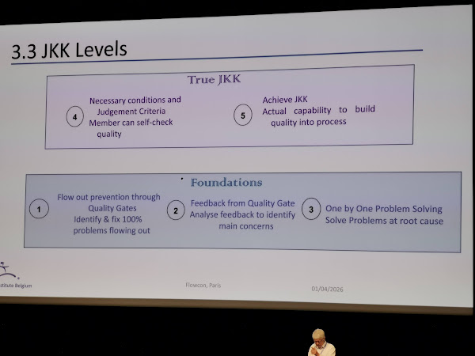

# FlowCon 2026 - Jidoka in Lean Engineering

*Pierre Masai (President, Lean Institute Belgium)*  
FlowCon 2026 — Paris, 1 April 2026

## Context: The Paradox of Lean / TPS

Two pillars of TPS:
- **Just in Time**: pull flow, eliminating *muda* (waste)
- **Jidōka** (自働化): stopping the flow in case of issues

💡 The paradox is resolved: stop the flow *now* to make the process flow *better in the future*.

## The Lean Ontology

Key concepts orbiting the Lean core:
- Stakeholder Satisfaction
- Customer First
- Just in Time
- Safety First
- Continuous Improvement (*kaizen*)
- Visualization (*mieruka*)
- Making things (*monozukuri*)
- **Stop in Time (*jidōka*)**
- Making People (*hitozukuri*)

## 3. Jidōka — The Three Methods

**Literal meaning**: JI = self, DO = move, KA = -ation suffix  
**Meaning**: Automation with a human touch. Second pillar of TPS alongside Just in Time.  
**Origin**: The automatic loom of Sakichi Toyoda that stopped by itself in case of a defect.

**Example applied to IT**:
- A program stopping automatically to prevent quality flowing out
- A programmer stopping his team when needing support

### Deep meaning: helping people

Intent: **helping people**

- Sakichi created the automatic loom to help his mother; later the loom stopped by itself in case of an issue (Type G loom in 1924)
- Later, workers could stop the line in a car factory when they needed help
- *Jidōka* helps and motivates people working with quality — this applies to all human activities

💡 Jidōka is not just about defect prevention — it's about empowering people to signal problems and get help.

### Why Jidōka Matters in IT Engineering

- **Managing Complex IT Systems**: embeds automated error detection and stoppage mechanisms
- **Early Error Interception**: detecting errors early prevents flawed builds and faulty deployments from reaching production
- **Reducing Operational Cost and Load**: early problem detection reduces debugging time and cognitive load
- **Supporting DevOps Goals**: improves stability, maintains SLOs, and builds quality into all development stages

### 3.1 Method #1 — Andon

**Literal meaning**: An = to go, DON = lamp  
**Meaning**: Ancient paper lantern; now used as *andon board* (visualization of production state) or *andon cord* (enables a worker to stop the line in case of defect).  
**Origin**: The automatic loom.

**Application to IT**:
- Management board (display screen) showing defects by importance and resolution status
- Impediment escalation to (top) management
- *Ōbeya* to visualize the whole IT situation

### 3.2 Method #2 — Pokayoke (ポカヨケ)

**Literal meaning**: *poka* = error, *yoke* = protection  
**Meaning**: Fool-proof or fail-safe device  
**Origin**: Device to prevent a worker from picking the wrong part, or to ensure a tool can only accept the correct part.

**Applied to IT**:
- Stop the computer automatically before a database can be corrupted
- Check-digit for a bank account
- Display an address on a map to visualize errors

**Areas for pokayoke in IT**:
- *Pokayoke* for developers:
  - Code indentation mandatory for Python
  - Linting (preventing errors directly at coding time)
  - Immediate notification of SQL injection or other cybersecurity risk
- *Pokayoke* for IT operations:
  - Warning of disk 80% full → OBLIGATION OF ACTION by the operator
- *Pokayoke* for users of IT systems:
  - Check digit for bank account number
  - Restriction of possible characters in input field
  - Show an address on a map (a city address should not be in the countryside…)

**Language/tooling examples**:
- Static-type checking — TypeScript or Flow (15% of JS bugs instantly detected)
- Null-safe languages — Kotlin, Rust, Dart and Swift by default; TypeScript and C# as opt-in
- Functional languages — Elm is a great example
- Linters — *pokayoke* for code, showing your mistakes
- Test-driven programming (TDD) from Kent Beck

### 3.3 Method #3 — Jikōtei Kanketsu (JKK / 自工程完結)

**Literal meaning**: Ji = Self, kōtei = Process, kanketsu = Completion  
**Meaning**: Developing, maintaining and continuously improving the best work processes by working in cooperation with previous and subsequent processes, to continuously produce the best outputs — *built-in quality with ownership*.  
**Origin**: The principles of *jidōka* evolved into the spirit of quality assurance, expressed as: "Building Quality into the Process."

#### Two methods of quality assurance

- ✗ **Relying on inspection**: Work → Final deliverable → Judgement by a third party
- ✓ **Building quality into the process (JKK)**: [Necessary conditions → Work → Judgement] × n → Final deliverable OK — *"Judging the quality of each process"* (Shinichi Sasaki, 2014)

#### Built-In Quality with Ownership

**Necessary conditions** (before starting each process):
- Good Design
- Good Process
- Capable Operator

**Judgement criteria** (at the check point):
- Self-Quality Check
- Authority to Stop
- Skill to Judge

#### What motivates an employee?

- Employees need to understand the value of their work
- Primary Process Ownership: sense of responsibility and pride
- Immediate feedback: fosters quicker improvement
- Positive feedback increases self-confidence
- Work becomes more interesting due to confidence

💡 JKK is as much about employee motivation as it is about quality.

#### 8 Steps to Establish JKK Work Processes

1. **Clarify purposes/targets** — reflect client's requirements and subsequent activities requirements
2. **Clearly visualize the final output** — One! Written. Diagrams and photographs. Actual objects.
3. **Write down process/procedure** — break down each process to the elemental task level (smallest decision-making units)
4. **Define judgement criteria** — from customer's point of view, criteria for proceeding to next process/procedure
5. **Define necessary conditions** — Information, Tools, Methods, Ability, Notes
6. **Accomplish work following plan** — work with confidence (Do of PDCA)
7. **Reflect on the work** — reflect not only on results but on each step of the process (Check of PDCA)
8. **Pass on the knowledge gained** — improve the process (Act of PDCA)

#### JKK Levels

**Foundations**:
1. Flow-out prevention through Quality Gates — identify & fix 100% of problems flowing out
2. Feedback from Quality Gate — analyse feedback to identify main concerns
3. One by One Problem Solving — solve problems at root cause

**True JKK**:
4. Necessary conditions and Judgement Criteria — member can self-check quality
5. Achieve JKK — actual capability to build quality into process

#### 10 Benefits of JKK

1. Eliminate Local Optimization
2. Create an opportunity for managers to check progress
3. Deepen Communication Across Divisions
4. Maximize the Unique Strengths of Each Department
5. Increase Information Sharing Within Departments
6. Reduce Meetings
7. Reveal unreasonableness (*muri*)
8. Reduce Failures and No Compromises
9. Increase Productivity
10. Increase Motivation

## 4. Applications to Modern Engineering

### What is often missing in Agile?

| Lean Concept                      | Agile Coverage                    |
|-----------------------------------|-----------------------------------|
| Customer First                    | Agile (if the PO is good!)        |
| Stakeholder Satisfaction          | Agile (partially)                 |
| Just in Time                      | Agile                             |
| Safety First                      | nothing                           |
| Continuous Improvement (*kaizen*) | Agile, but without *hoshin kanri* |
| Visualization (*mieruka*)         | Agile (Jira, Kanban boards)       |
| Making things (*monozukuri*)      | Agile (partially)                 |
| **Stop in Time (*jidōka*)**       | **very little**                   |
| Making People (*hitozukuri*)      | Agile (partially)                 |

💡 Agile covers most of Lean *except* jidōka (stopping the flow) and safety first — the most "counter-flow" parts of Lean.

### The Chief Engineer

A role often missing in IT despite the names:

- Must be respected by the whole organization
- No hierarchical responsibility
- Full P&L responsibility for the whole product lifecycle

Questions to ask:
- Is the (Chief) Product Owner such a person? How to choose him/her?
- What if the job had a semi-god status — with humility?
- What if the best person (who has no time!) was the PO?

💡 This is a role that is often missing in IT — a true Chief Engineer with full ownership and accountability, not just a title.

## References

### People
- **Pierre Masai** — President, Lean Institute Belgium; former CIO Toyota Motor Europe (2005–2020), Chief Global Strategy Toyota Systems (Nagoya, 2020–2023)
- **Sakichi Toyoda** — Inventor of the automatic loom (Type G, 1924); founder of Toyota
- **Shinichi Sasaki** — Referenced for JKK / quality assurance model (2014)
- **Kent Beck** — Creator of Test-Driven Development (TDD)

### Books & Thesis
- Pierre Masai, *Modeling the lean organization as a complex system*, PhD thesis, University of Strasbourg, 2017 — https://www.theses.fr/2017STRAD029/document

### Concepts
- **Jidōka** (自働化) — "Automation with a human touch"; one of the two pillars of TPS; stopping the line when a defect is detected
- **Just in Time** — Pull flow system eliminating *muda* (waste); the other TPS pillar
- **Muda** — Waste
- **Muri** — Unreasonableness
- **Andon** — Signal lamp / board for visualizing production state and alerting on issues
- **Pokayoke** (ポカヨケ) — Fail-safe device; "poka" = error, "yoke" = protection
- **Jikōtei Kanketsu (JKK)** (自工程完結) — Built-in quality with ownership; "Self Process Completion"
- **Kaizen** — Continuous improvement
- **Mieruka** — Visualization
- **Monozukuri** — Making things / craftsmanship
- **Hitozukuri** — Making people / people development
- **Hoshin Kanri** — Policy deployment / strategic alignment
- **Ōbeya** — "Big room"; visual management room for whole project/IT situation
- **PDCA** — Plan-Do-Check-Act cycle
- **TPS** — Toyota Production System

### Organizations
- **Lean Institute Belgium** — https://www.leaninstitute.be
