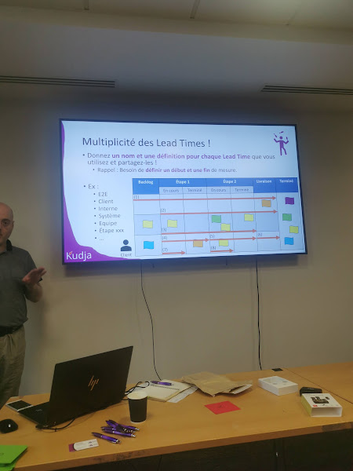
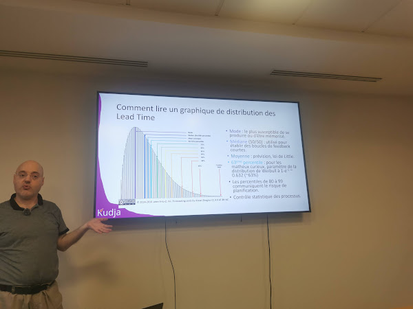
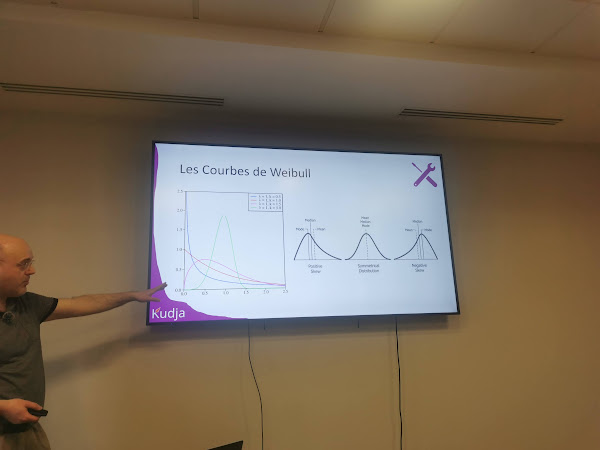
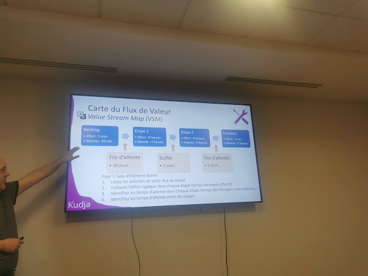

# FlowCon 2026 - La taille des éléments de travail ça compte ?

*Sébastien Goodwin (Formateur et Coach Kanban Accrédité, Kudja)*  
FlowCon 2026 — Paris, 1 avril 2026

[Sched](https://sched.co/2DqTu)

> Lead Time = livrer **la bonne valeur** **à temps**

Pas de prescription à avoir des éléments de même taille, mais impact potentiel sur le Lead Time.

## Work Item

> Demande de travail unitaire qui a du sens et de la valeur pour un client

Les Work Item types se définissent par :
- Source et nature
- Activité du flux de réalisation
- Urgence / importance
- Compétences requises
- Échelle et complexité

## Lead Time

Préférer le terme du contexte (Lead Time, délai de réalisation…) pour limiter la résistance dans l'équipe.

Définition : pour un élément de travail donné, durée de temps écoulé pour réaliser une tâche ou un ensemble de tâches interdépendantes.

- C'est un **chiffre**
- Mesure de **temps**
- Début et fin **à définir explicitement**
- Associé à un **Work Item**

💡 Les Lead Times sont multiples : **préciser le Lead Time de quoi**.

### Lead Time vs Cycle Time

Historique confus — en Lean Manufacturing :
- **Lead Time** : associé à un Work Item. Combien de temps pour réaliser cet élément ?
- **Cycle Time** : associé à une activité / ressource. Combien de temps pour revenir à l'état initial ?

### Multiplicité des Lead Times

Donner un **nom** et une **définition** pour chaque Lead Time utilisé. Exemples : E2E, Client, Interne, Système, Équipe.

### Distribution de Lead Time

- Lead Time pour 1 élément → chiffre ; pour un ensemble d'éléments → **distribution**
- Axes : X = lead time, Y = nombre d'éléments
- ⚠️ Ce n'est **pas** une gaussienne : dangereux d'utiliser des moyennes ou des variances
- Utiliser : **mode**, **médiane**, **moyenne**, **80e/Xe percentile**
- Bosses multiples = courbes multimodales

#### Les courbes de Weibull

Les distributions de Lead Time suivent les courbes de Weibull.

## VSM : Value Stream Mapping

Lister et quantifier l'effort et l'attente pour chaque étape et pour chaque transition (buffer).

⚠️ Chaque valeur est en fait une distribution car la variabilité est forte.

### Efficacité du processus (Flow Efficiency)

> Ratio du temps de travail effectif par rapport au temps total

- Valeur typique sur un process non optimisé : **1–5 %**
- Marge d'amélioration importante : **×20 à ×100**

💡 L'IA améliore le **numérateur** (temps de travail effectif), mais le plus gros gain est sur le **dénominateur** (réduction des temps d'attente).

💡 La taille des éléments influe peu sur le Lead Time **dans un flux de travail peu efficace**.

## Sources de variabilité

(Deming)

**Sources communes** — bruit dans le système ; dépend de la gestion du flux et de la façon de travailler dans l'organisation.

Leviers de gestion du flux (règles du système) :
- Planification
- Ordre
- Priorité (Classes de Service)
- Gestion des blocages, dépendances, âge des éléments, risques

**Sources spéciales** — événements extérieurs au système (Covid-19, compétition, disruptions technologiques…)

💡 Ces sources amplifient l'instabilité dans le Lead Time. Les décisions de gestion amplifient également cette instabilité.

💡 Les sources de variabilité viennent **amplifier la décorrélation entre effort et Lead Time**.

## Risques liés à la taille des éléments

- **Item trop gros** : on perd la notion de suivi d'avancement et on masque les blocages

## References

**Personnes**
- Sébastien Goodwin — Formateur et Coach Kanban Accrédité (AKT, KCP), Kudja
- W. Edwards Deming — statisticien et consultant, distinction sources communes / spéciales de variabilité

**Livres**
- *Thinking in Systems* — Donella H. Meadows ([Google Books][thinking-in-systems])

**Concepts**
- Work Item — demande de travail unitaire avec valeur pour un client
- Lead Time — temps écoulé pour réaliser un Work Item (début et fin à définir)
- Cycle Time — temps associé à une activité/ressource pour revenir à l'état initial
- VSM (Value Stream Mapping) — cartographie du flux de valeur
- Flow Efficiency — ratio temps de travail effectif / temps total
- Courbes de Weibull — famille de distributions statistiques adaptées aux Lead Times
- Classes de Service — règles de priorité dans un système Kanban
- Sources communes de variabilité — bruit inhérent au système (Deming)
- Sources spéciales de variabilité — événements perturbateurs extérieurs (Deming)

[thinking-in-systems]: https://books.google.fr/books/about/Thinking_in_Systems.html?id=CpbLAgAAQBAJ
